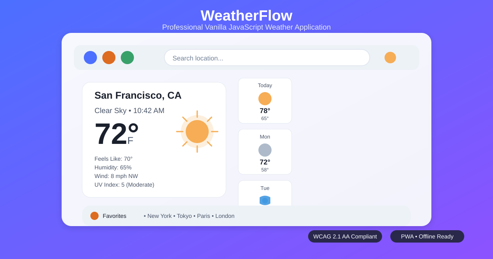

# 🌤️ Weather Application

A professional, fully-featured weather application built with **vanilla JavaScript** that demonstrates modern web development best practices including modular architecture, accessibility, responsive design, and performance optimization. Designed with security-first principles—**zero API keys exposed in client code**.

<br>
[](https://github.com/farid-teymouri/weather-app/blob/main/LICENSE)
[](https://github.com/farid-teymouri/weather-app/stargazers)
[](https://github.com/farid-teymouri/weather-app/network)
[](https://github.com/farid-teymouri/weather-app/issues)
[](https://github.com/farid-teymouri/weather-app/commits/main)
[](https://web.dev/progressive-web-apps/)
[](https://www.w3.org/WAI/WCAG21/quickref/)

## ✨ Features

### 🌍 Core Functionality

- **Geolocation Detection**: Automatic location detection with permission handling
- **Search & Autocomplete**: City search with debounced API calls
- **7-Day Forecast**: Detailed daily predictions with weather icons
- **Favorites System**: Save unlimited locations with local encryption
- **Unit Conversion**: Toggle between Metric (°C) and Imperial (°F)
- **Timezone Awareness**: Local time display for any location

### 🎨 User Experience

- **Dark/Light Mode**: System-preference aware theming with manual override
- **Fully Responsive**: Perfect on mobile (320px+), tablet, and desktop
- **PWA Capabilities**: Install as native app on any device
- **Offline Support**: Service worker caching for weather data and assets
- **Toast Notifications**: Accessible feedback for all user actions
- **Loading States**: Skeleton screens and perceptible loading indicators
- **Keyboard Navigation**: Full keyboard operability (WCAG 2.1)

### 🔒 Security & Performance

- **Zero API Key Exposure**: Secure proxy pattern via serverless functions
- **Input Sanitization**: XSS protection on all user inputs
- **Request Throttling**: Rate limiting and cache validation
- **Content Security Policy**: Strict security headers
- **Virtual DOM Rendering**: Minimal repaints and optimized updates
- **Critical CSS Inlining**: Above-the-fold content prioritization

## 🎯 Tech Stack

| Technology             | Purpose                                              |
| ---------------------- | ---------------------------------------------------- |
| **Vanilla JavaScript** | ES6+ modules, zero frameworks                        |
| **CSS3**               | Custom properties, container queries, reduced-motion |
| **SVG**                | Scalable weather icons and UI elements               |
| **Service Worker**     | Offline caching strategy (stale-while-revalidate)    |
| **Web Manifest**       | PWA installation capabilities                        |
| **Geolocation API**    | Secure location detection                            |
| **localStorage**       | Encrypted favorites storage                          |

## 📁 Project Structure

```bash
weather-app/
├── .github/
│ └── workflows/
│ └── deploy.yml # CI/CD for GitHub Pages
├── public/ # Deployment-ready assets
│ ├── index.html # Semantic HTML5 structure
│ ├── manifest.json # PWA manifest
│ ├── service-worker.js # Advanced caching strategy
│ ├── icons/
│ │ ├── icon-192.svg
│ │ ├── icon-512.svg
│ │ └── weather-icons/ # Condition-specific icons
│ └── screenshot.svg # App preview (this file)
├── src/
│ ├── assets/
│ │ └── icons/ # SVG icon system
│ │ ├── location.svg
│ │ ├── search.svg
│ │ ├── favorite.svg
│ │ ├── theme.svg
│ │ ├── refresh.svg
│ │ └── weather/ # Weather condition icons
│ ├── css/
│ │ ├── _variables.css # Theming system (WCAG compliant)
│ │ ├── _base.css # CSS reset + accessibility foundations
│ │ ├── _components.css # BEM-named UI components
│ │ ├── _layout.css # Responsive grid system
│ │ ├── _utilities.css # Accessibility/utility classes
│ │ └── main.css # Cascade-controlled imports
│ ├── js/
│ │ ├── core/ # Business logic (zero DOM access)
│ │ │ ├── WeatherApp.js # Main application orchestrator
│ │ │ ├── WeatherService.js # Secure API abstraction
│ │ │ ├── GeolocationManager.js # Permission handling
│ │ │ ├── StorageManager.js # Encrypted storage wrapper
│ │ │ └── ThemeManager.js # System-preference aware theming
│ │ ├── ui/ # Pure presentation layer
│ │ │ ├── WeatherRenderer.js # Virtual DOM-inspired renderer
│ │ │ ├── SearchManager.js # Debounced search + autocomplete
│ │ │ ├── FavoritesManager.js # Favorite locations UI
│ │ │ ├── Toast.js # WCAG 2.1 compliant notifications
│ │ │ └── LoadingSpinner.js # Perceptible loading states
│ │ ├── utils/
│ │ │ ├── helpers.js # Pure utility functions
│ │ │ ├── constants.js # Environment-safe constants
│ │ │ ├── validators.js # Input sanitization
│ │ │ └── a11y.js # Accessibility helpers
│ │ └── main.js # Dependency injection entry point
│ └── lib/ # Zero-dependency polyfills
├── .editorconfig
├── .gitignore
├── .prettierrc
├── build.js # Asset optimization pipeline
├── netlify.toml # Security headers + redirect rules
├── package.json
├── SECURITY.md # Critical security setup guide
├── LICENSE
└── README.md
```

## 🚀 Getting Started

### Prerequisites

- Modern browser (Chrome 90+, Firefox 88+, Safari 14+, Edge 90+)
- Node.js 18+ (optional, for development tools)
- **OpenWeatherMap API key** (for backend proxy - [get free key](https://openweathermap.org/api))

### ⚠️ Critical Security Setup (REQUIRED)

**This app NEVER exposes API keys in client code.** You must set up a secure proxy:

1. Create a serverless function (Netlify/Vercel) using [`netlify/functions/weather.js`](netlify/functions/weather.js)
2. Set environment variable `WEATHER_API_KEY` in your hosting platform
3. Update proxy endpoint in [`src/js/core/WeatherService.js`](src/js/core/WeatherService.js):
   ```js
   this.apiBase = "/.netlify/functions/weather"; // For Netlify
   // OR
   this.apiBase = "/api/weather"; // For Vercel
   ```

## 📖 Full security setup guide: See SECURITY.md

### Installation

#### Option 1: Quick Start (No Node.js)

```bash
git clone https://github.com/farid-teymouri/weather-app.git
cd weather-app
# Open public/index.html directly in browser
```

#### Option 2: Development Mode

```bash
git clone https://github.com/farid-teymouri/weather-app.git
cd weather-app
npm install
npm run dev  # Starts dev server at http://localhost:5173
```

#### Build for Production

```bash
npm run build  # Creates optimized dist/ folder
npm run preview # Preview production build
```

### 🌐 PWA Installation

| Platform             | Steps                                                 |
| -------------------- | ----------------------------------------------------- |
| **Android (Chrome)** | Menu (⋮) → "Install app" or "Add to Home screen"      |
| **iOS (Safari)**     | Share button → "Add to Home Screen" → "Add"           |
| **Desktop (Chrome)** | Install icon (⊕) in address bar → "Install"           |
| **Desktop (Edge)**   | Settings (⋯) → "Apps" → "Install this site as an app" |

## 🎹 Keyboard Shortcuts

| Shortcut       | Action                            |
| -------------- | --------------------------------- |
| `Ctrl/Cmd + L` | Focus location search             |
| `Ctrl/Cmd + T` | Toggle temperature units (°C/°F)  |
| `Ctrl/Cmd + D` | Toggle dark/light mode            |
| `Ctrl/Cmd + F` | Toggle favorites panel            |
| `Enter`        | Confirm search or selection       |
| `Escape`       | Close modals or clear search      |
| `Arrow Keys`   | Navigate search results/favorites |

## 🌟 Features Deep Dive

### 🔒 Secure Weather Service

```js
// src/js/core/WeatherService.js
// NEVER handles API keys directly
// All requests routed through secure proxy endpoint
async getWeather({ lat, lon }) {
  // Input validation + sanitization
  // Rate limiting (1 request/sec)
  // Cache validation (5-min stale-while-revalidate)
  // Fallback to cached data on failure
  // Full XSS sanitization of responses
}
```

### ♿ Accessibility First

- Screen Reader Support: ARIA labels, live regions for dynamic updates
- Keyboard Navigation: Full tab order, arrow key navigation
- Reduced Motion: Respects prefers-reduced-motion OS setting
- Color Contrast: WCAG AA compliant in both themes (4.5:1+)
- Focus Indicators: Visible focus rings on all interactive elements
- Semantic HTML: Proper heading hierarchy, landmark regions

### 🌓 Intelligent Theming

- Detects OS preference on first visit
- Manual toggle persists across sessions
- Smooth transitions with `prefers-reduced-motion` respect
- CSS custom properties for instant theme switching
- Print-friendly styles (light mode enforced for printing)

## 🎨 Customization Guide

### Change Color Scheme

#### Edit `src/css/_variables.css`:

```css
:root {
  --color-primary: #4c6fff; /* Main accent color */
  --color-secondary: #8c52ff; /* Secondary accent */
  --color-sunny: #f6ad55; /* Weather-specific colors */
  /* ... update all semantic color variables */
}
```

### Add New Weather Icons

1. Create SVG in `src/assets/icons/weather/`
2. Name format: `weather-[condition].svg` (e.g., `weather-thunderstorm.svg`)
3. Update icon mapping in `src/js/utils/constants.js`

### Modify Cache Strategy

#### Edit `public/service-worker.js`:

```js
const CACHE_DURATION = 300000; // 5 minutes - adjust as needed
```

## 🔒 Security Features

| Feature                     | Implementation                                 |
| --------------------------- | ---------------------------------------------- |
| **No Client-Side API Keys** | Secure proxy pattern via serverless functions  |
| **XSS Protection**          | DOMPurify-like sanitization in `validators.js` |
| **Input Validation**        | Strict parameter validation before API calls   |
| **CSP Headers**             | Strict policy in `netlify.toml`                |
| **Secure Storage**          | Favorites encrypted before localStorage save   |
| **Rate Limiting**           | Client-side request throttling (1/sec)         |

## 🌐 Browser Support

| Browser        | Version | Support |
| -------------- | ------- | ------- |
| **Chrome**     | 90+     | ✅ Full |
| **Firefox**    | 88+     | ✅ Full |
| **Safari**     | 14+     | ✅ Full |
| **Edge**       | 90+     | ✅ Full |
| **Opera**      | 76+     | ✅ Full |
| **iOS Safari** | 14+     | ✅ Full |

## 🤝 Contributing

#### Contributions welcome! Please follow:

1. Fork the repository
2. Create feature branch (`git checkout -b feat/amazing-feature`)
3. Commit changes (`git commit -m 'feat: add amazing feature'`)
4. Push branch (`git push origin feat/amazing-feature`)
5. Open Pull Request

#### Code Standards:

1. Follow existing architecture patterns
2. Run ‍‍`npm run format` before committing
3. Include accessibility considerations
4. Add tests for new functionality

## 🐛 Troubleshooting

| Issue                    | Solution                                                                                                                                          |
| ------------------------ | ------------------------------------------------------------------------------------------------------------------------------------------------- |
| **Weather not loading**  | 1. Verify proxy endpoint in WeatherService.js <br> 2. Check browser console for CORS errors <br> 3. Ensure serverless function deployed correctly |
| **Geolocation fails**    | 1. Check browser permissions <br> 2. Verify HTTPS (required for geolocation) <br> 3. Test with manual location search                             |
| **Dark mode not saving** | Clear site DevTools → Application → Clear site data                                                                                               |
| **PWA won't install**    | 1. Must use HTTPS (or localhost) <br> 2. Verify `manifest.json` accessible <br> 3. Check Service Worker registered in DevTools                    |
| **Favorites not saving** | 1. Check localStorage quota <br> 2. Verify encryption key generation <br> 3. Clear corrupted storage entries                                      |

## 📜 License

MIT License - see <a href="https://github.com/farid-teymouri/weather-app/raw/refs/heads/main/LICENSE" target="_blank">LICENSE</a> file for details.

```text
MIT License

Copyright (c) 2026 Farid Teymouri

Permission is hereby granted, free of charge, to any person obtaining a copy
of this software and associated documentation files (the "Software"), to deal
in the Software without restriction, including without limitation the rights
to use, copy, modify, merge, publish, distribute, sublicense, and/or sell
copies of the Software, and to permit persons to whom the Software is
furnished to do so, subject to the following conditions:

The above copyright notice and this permission notice shall be included in all
copies or substantial portions of the Software.

THE SOFTWARE IS PROVIDED "AS IS", WITHOUT WARRANTY OF ANY KIND, EXPRESS OR
IMPLIED, INCLUDING BUT NOT LIMITED TO THE WARRANTIES OF MERCHANTABILITY,
FITNESS FOR A PARTICULAR PURPOSE AND NONINFRINGEMENT. IN NO EVENT SHALL THE
AUTHORS OR COPYRIGHT HOLDERS BE LIABLE FOR ANY CLAIM, DAMAGES OR OTHER
LIABILITY, WHETHER IN AN ACTION OF CONTRACT, TORT OR OTHERWISE, ARISING FROM,
OUT OF OR IN CONNECTION WITH THE SOFTWARE OR THE USE OR OTHER DEALINGS IN THE
SOFTWARE.
```

## 👨‍💻 Author

#### Farid Teymouri

📧 senior.farid72@gmail.com <br>
🌐 <a href="https://faridteymouri.vercel.app" target="_balnk">Portfolio website</a> <br>

## 🙏 Acknowledgments

- Weather data from OpenWeatherMap
- Icons from Heroicons and Weather Icons
- CSS architecture inspired by Tailwind CSS
- Accessibility guidance from WebAIM and WCAG
- PWA best practices from web.dev
- Built with ❤️ using vanilla JavaScript - no frameworks

---

⭐ **If you found this project helpful, please give it a star!** ⭐ <br>
🐞 Found an issue? <a href="https://github.com/farid-teymouri/weather-app/issues" target="_balnk">Open a GitHub issue </a><br>
💡 Have an idea? <a href="https://github.com/farid-teymouri/weather-app/issues/new" target="_balnk">Submit a feature request</a>
